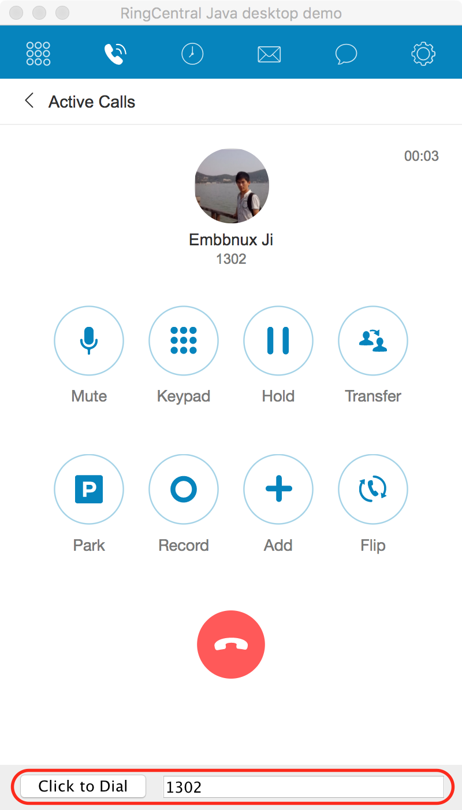

# JxBrowser WebRTC

Try WebRTC in JxBrowser to demonstrate that it is possible to have full RingCental capability in a Java desktop app.

Video demo: https://www.youtube.com/watch?v=SKpLd20b2OM&feature=youtu.be


## Two way communication

### Java call JS: Click to dial



### JS call Java: Incoming call screen pop


## Setup

Please follow [this guide](https://jxbrowser-support.teamdev.com/docs/guides/installation/classpath.html) to download and save JxBrowser jar files file into the `libs/` directory. For more information pleaser refer to the [documentation of JxBrowser](https://jxbrowser-support.teamdev.com/docs/quickstart/#quick-start).


## Build

```
./gradlew build
```


## Run

```
./gradlew run
```
