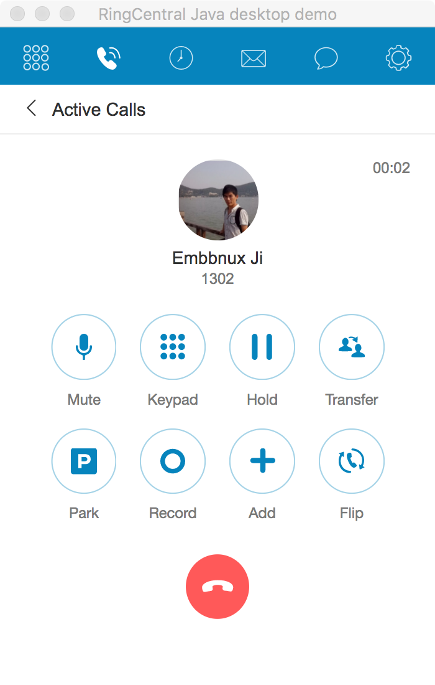

# JxBrowser WebRTC

Try WebRTC in JxBrowser to demonstrate that it is possible to have full RingCental capability in a Java desktop app.




## Setup

Please follow [this guide](https://jxbrowser.support.teamdev.com/support/solutions/articles/9000012864-quick-start-guide-for-swing-developers) to download and save JxBrowser jar files together with the license jar file into the `libs/` directory.


## Build

```
./gradlew build
```


## Run

```
./gradlew run
```
